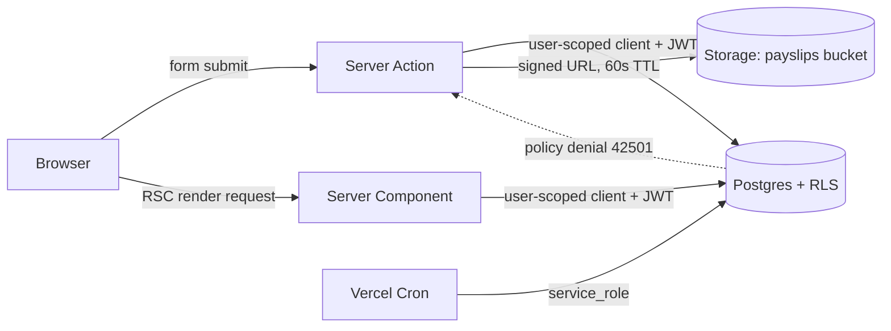

# Technical Design — SMB Payroll & Bookkeeping Portal

> Deliverable #4 ("תכנון טכני מפורט") for RUNI CS 2026 Internet Technologies.
> Written before implementation, so we know exactly what we are building.

## Documents in this set

| File | Contents |
| --- | --- |
| `00-overview.md` | Scope, stack, roles, permission model |
| `01-database.md` | Schema, constraints, indexes, views |
| `02-rls.md` | Row Level Security for the three roles, Storage policies |
| `03-api.md` | Server Actions, Route Handlers, RPCs, CRUD matrix |
| `04-frontend.md` | Folder structure, components, state, validation, errors |
| `05-business-logic.md` | Salary insights math, leave accounting, state machines |
| `06-ux.md` | Screen-by-screen UX for each role |

---

## 1. Problem and scope

Small and medium businesses in Israel typically outsource payroll to an external
bookkeeper. The result is a document-by-email process: employees WhatsApp the
bookkeeper asking for last year's Form 106, managers approve vacation days in a
spreadsheet, and nobody can answer "how much was deducted from me this year?"
without opening twelve PDFs.

This product gives each SMB one portal with three role-specific views:

- **Employee** — salary insights (averages, fluctuations, deductions), leave
  balance, download pay slips and forms, submit time-off requests.
- **Manager** — read-only view of their direct team's data and forms, plus
  approve/reject their team's time-off requests.
- **Bookkeeper** — upload pay slips, assign them to employees, maintain salary
  data and leave entitlements.

### Explicitly out of scope (v1)

Running payroll calculations, bank/tax-authority integrations, payments,
multi-level approval chains, org-chart editing, and mobile apps. We store and
present payroll data produced elsewhere; we do not compute gross-to-net.

---

## 2. Stack and rationale

| Concern | Choice | Why this and not the alternative |
| --- | --- | --- |
| Framework | Next.js 15, App Router | Server Components let us keep payroll data server-side by default; Server Actions remove the need to hand-write CRUD endpoints |
| Language | TypeScript (strict) | Generated Supabase types make schema drift a compile error |
| Database | Supabase Postgres | RLS pushes authorization into the database, so a forgotten check in a component cannot leak another person's salary |
| Auth | Supabase Auth (email + magic link) | Same `auth.uid()` that RLS policies read; no second identity system to keep in sync |
| Files | Supabase Storage (private bucket) | Path-based RLS on the same principals; short-lived signed URLs instead of public links |
| Styling | Tailwind CSS + shadcn/ui | Accessible primitives we own in-repo, no runtime theme library |
| Forms | react-hook-form + Zod | One Zod schema validates on the client and re-validates inside the Server Action |
| Charts | Recharts | Declarative SVG, small enough for the four charts we need |
| Tables | TanStack Table (headless) | Sorting/pagination without adopting a design system |
| Dates | date-fns + date-fns-tz | Tree-shakeable; we need Asia/Jerusalem business-day math |
| Hosting | Vercel | Assignment requirement; co-located with Next.js runtime |
| Tests | Vitest + RTL, Playwright | Vitest for logic and Zod schemas, Playwright for the three role flows and RLS |

### Key architectural decision: RLS is the authorization boundary

Every read goes through a Supabase client that carries the user's JWT, so
Postgres decides what rows come back. Server Actions add a second check before
writing (fail fast with a good error message), but they are *not* the only line
of defense. The `service_role` key is used in exactly two places — user
invitation and the nightly leave-accrual cron — and never in code reachable from
a request handler that trusts client input.



---

## 3. Tenancy and roles

A person is one `auth.users` row and one `profiles` row globally. Their
permissions come from `memberships`: one row per `(company, person)` carrying a
role. This shape matters because:

- A bookkeeper serves **several** SMBs — one identity, many memberships.
- A manager is also an employee: they see their own salary as an employee and
  their team's data as a manager. Two concerns, one membership row with
  `role = 'manager'`.
- Revoking access is `is_active = false` on one row, not a cascade of deletes.

`role` is a Postgres enum, not free text:

```sql
create type app_role as enum ('employee', 'manager', 'bookkeeper');
```

### Permission matrix

| Capability | Employee | Manager | Bookkeeper |
| --- | :---: | :---: | :---: |
| Read own profile / salary insights | ✅ | ✅ | ✅ (if also an employee) |
| Download own pay slips and forms | ✅ | ✅ | ✅ |
| Submit time-off request | ✅ | ✅ | ✅ |
| Cancel own *pending* request | ✅ | ✅ | ✅ |
| Read direct reports' employee records | ❌ | ✅ | ✅ (all in company) |
| Read direct reports' pay slip **metadata** | ❌ | ✅ | ✅ |
| Download direct reports' pay slip **PDFs** | ❌ | ⚙️ off by default | ✅ |
| Approve / reject team time-off | ❌ | ✅ (direct reports only) | ❌ |
| Upload / assign pay slips | ❌ | ❌ | ✅ |
| Edit salary components and leave entitlements | ❌ | ❌ | ✅ |
| Publish a payroll period | ❌ | ❌ | ✅ |
| Create employees, invite users | ❌ | ❌ | ✅ |

⚙️ `companies.managers_can_view_payslip_files` defaults to `false`. A manager
legitimately needs team cost aggregates and leave planning; the pay slip PDF
contains a national ID and bank details they usually should not hold. Making it
an explicit per-company flag documents the decision instead of hiding it.

Note the asymmetry the matrix makes visible: the bookkeeper can *write* payroll
but cannot *approve* leave, and the manager can *approve* leave but cannot write
payroll. Neither role is a superset of the other, which is why a single
`is_admin` boolean would not have worked.
