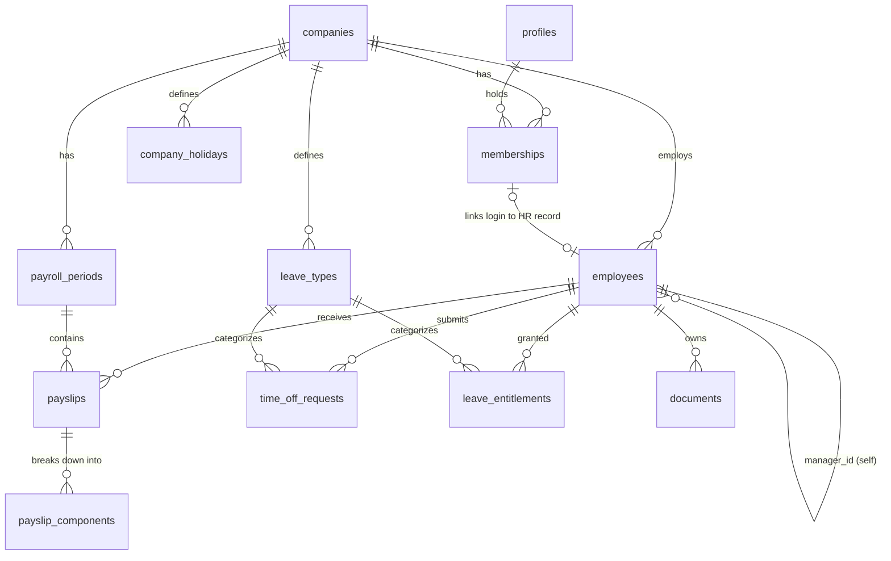

# Database Design

Postgres 15 on Supabase. Migrations live in `supabase/migrations/` and are
applied with the Supabase CLI, so the schema is reviewable in git.

## 1. Entity relationships



## 2. Core tables

### `profiles` — one row per login

```sql
create table profiles (
  id          uuid primary key references auth.users(id) on delete cascade,
  full_name   text not null check (length(btrim(full_name)) between 2 and 120),
  email       citext not null unique,
  phone       text check (phone ~ '^\+?[0-9\-\s]{7,20}$'),
  locale      text not null default 'he' check (locale in ('he', 'en')),
  created_at  timestamptz not null default now()
);
```

`id` is the same uuid as `auth.users.id`. Populated by an `after insert` trigger
on `auth.users` so a profile can never be missing for a valid session.

### `companies` — the tenant

```sql
create table companies (
  id        uuid primary key default gen_random_uuid(),
  name      text not null check (length(btrim(name)) >= 2),
  tax_id    text not null,                        -- ח.פ. / עוסק מורשה
  timezone  text not null default 'Asia/Jerusalem',
  currency  char(3) not null default 'ILS',
  week_start_day smallint not null default 0 check (week_start_day between 0 and 6),
  weekend_days   smallint[] not null default '{5,6}',  -- Fri, Sat
  managers_can_view_payslip_files boolean not null default false,
  created_at timestamptz not null default now(),
  unique (tax_id)
);
```

`weekend_days` and `company_holidays` are data, not constants, because a design
that hardcodes Saturday breaks the moment this is sold to a company with a
Sunday–Thursday week.

### `memberships` — the authorization table

```sql
create table memberships (
  id          uuid primary key default gen_random_uuid(),
  company_id  uuid not null references companies(id) on delete cascade,
  profile_id  uuid not null references profiles(id) on delete cascade,
  role        app_role not null,
  is_active   boolean not null default true,
  invited_by  uuid references profiles(id),
  created_at  timestamptz not null default now(),
  unique (company_id, profile_id)
);
create index on memberships (profile_id) where is_active;
create index on memberships (company_id, role) where is_active;
```

One role per person per company (the unique constraint). A person needing two
roles in one company is a data-modelling smell we reject deliberately: managers
already get employee capabilities on their own record without a second row.

### `employees` — the HR record

```sql
create table employees (
  id              uuid primary key default gen_random_uuid(),
  company_id      uuid not null references companies(id) on delete cascade,
  membership_id   uuid unique references memberships(id) on delete set null,
  employee_number text not null,
  full_name       text not null,
  national_id_last4 char(4),
  department      text,
  job_title       text,
  manager_id      uuid references employees(id) on delete set null,
  employment_type text not null default 'monthly'
                  check (employment_type in ('monthly', 'hourly', 'contractor')),
  start_date      date not null,
  end_date        date check (end_date is null or end_date >= start_date),
  status          text not null default 'active'
                  check (status in ('active', 'on_leave', 'terminated')),
  created_at      timestamptz not null default now(),
  unique (company_id, employee_number),
  check (manager_id is distinct from id)
);
create index on employees (company_id, status);
create index on employees (manager_id) where manager_id is not null;
create index employees_name_trgm on employees using gin (full_name gin_trgm_ops);
```

Three details worth defending:

- **`membership_id` is nullable.** The bookkeeper creates employee records before
  those people ever log in, and terminated employees keep their historical
  records after their login is removed. Payroll history must outlive accounts.
- **Only `national_id_last4`.** Enough to reconcile against the payroll software's
  export, not enough to be a breach. We never store the full national ID.
- **`gin_trgm_ops` index** backs the "assign pay slip by name" search, so the
  bookkeeper can type "yaacob" and get a match without a full table scan.

### `payroll_periods` — the publish gate

```sql
create table payroll_periods (
  id          uuid primary key default gen_random_uuid(),
  company_id  uuid not null references companies(id) on delete cascade,
  year        smallint not null check (year between 2000 and 2100),
  month       smallint not null check (month between 1 and 12),
  status      text not null default 'draft'
              check (status in ('draft', 'published', 'locked')),
  published_at timestamptz,
  published_by uuid references profiles(id),
  created_at  timestamptz not null default now(),
  unique (company_id, year, month),
  check ((status = 'draft') = (published_at is null))
);
```

This table exists so a bookkeeper can spend an afternoon uploading and fixing 40
pay slips without employees seeing half-finished data. Nothing is visible to an
employee until the period flips to `published`. It also gives us a clean
immutability point: `locked` periods reject all writes via trigger.

### `payslips`

```sql
create table payslips (
  id            uuid primary key default gen_random_uuid(),
  company_id    uuid not null references companies(id) on delete cascade,
  period_id     uuid not null references payroll_periods(id) on delete cascade,
  employee_id   uuid references employees(id) on delete restrict,
  gross_pay     numeric(12,2) not null default 0 check (gross_pay >= 0),
  net_pay       numeric(12,2) not null default 0 check (net_pay >= 0),
  total_deductions numeric(12,2) not null default 0 check (total_deductions >= 0),
  employer_cost numeric(12,2) check (employer_cost >= 0),
  paid_days     numeric(5,2) check (paid_days >= 0),
  file_path     text,                       -- object key in the payslips bucket
  file_size     integer check (file_size between 1 and 10485760),
  file_checksum text,                       -- sha256, used to reject duplicates
  status        text not null default 'unassigned'
                check (status in ('unassigned', 'assigned', 'published')),
  uploaded_by   uuid not null references profiles(id),
  created_at    timestamptz not null default now(),
  updated_at    timestamptz not null default now(),
  unique (period_id, employee_id),
  check (net_pay <= gross_pay),
  check (status = 'unassigned' or employee_id is not null)
);
create index on payslips (employee_id, period_id);
create index on payslips (company_id, status) where status = 'unassigned';
```

`numeric(12,2)` and never `float`: money in binary floating point produces
`0.1 + 0.2 != 0.3`, and a payroll portal that displays ₪10,432.99**9** loses all
credibility. The `unique (period_id, employee_id)` constraint is the database
enforcing "one pay slip per person per month" — the guard against a bookkeeper
double-assigning a file. `on delete restrict` on `employee_id` means you cannot
delete a person who has payroll history.

### `payslip_components` — the deduction breakdown

```sql
create type component_kind as enum ('earning', 'deduction', 'employer_contribution');

create table payslip_components (
  id          uuid primary key default gen_random_uuid(),
  payslip_id  uuid not null references payslips(id) on delete cascade,
  kind        component_kind not null,
  code        text not null,     -- 'base', 'overtime', 'income_tax', 'ni', 'pension'
  label       text not null,     -- shown to the user, may be Hebrew
  amount      numeric(12,2) not null check (amount >= 0),
  sort_order  smallint not null default 0,
  unique (payslip_id, kind, code)
);
create index on payslip_components (payslip_id);
```

This is the table that makes the employee dashboard interesting. Without it,
"deductions" is a single number; with it, we can show that income tax is 62% of
the employee's deductions and that their pension contribution rose in March.

A trigger keeps the parent row's totals consistent rather than trusting the
client to send matching sums:

```sql
create or replace function recalc_payslip_totals() returns trigger
language plpgsql as $$
declare pid uuid := coalesce(new.payslip_id, old.payslip_id);
begin
  update payslips p set
    gross_pay = coalesce((select sum(amount) from payslip_components
                          where payslip_id = pid and kind = 'earning'), 0),
    total_deductions = coalesce((select sum(amount) from payslip_components
                                 where payslip_id = pid and kind = 'deduction'), 0),
    updated_at = now()
  where p.id = pid;
  update payslips set net_pay = gross_pay - total_deductions where id = pid;
  return null;
end $$;

create trigger trg_recalc_payslip_totals
after insert or update or delete on payslip_components
for each row execute function recalc_payslip_totals();
```

### Leave: types, entitlements, requests

```sql
create table leave_types (
  id          uuid primary key default gen_random_uuid(),
  company_id  uuid not null references companies(id) on delete cascade,
  code        text not null,   -- 'vacation', 'sick', 'reserve_duty', 'unpaid'
  name        text not null,
  is_paid     boolean not null default true,
  requires_approval boolean not null default true,
  accrual_days_per_month numeric(5,2) not null default 0,
  max_carryover_days     numeric(5,2) not null default 0,
  is_active   boolean not null default true,
  unique (company_id, code)
);

create table leave_entitlements (
  id            uuid primary key default gen_random_uuid(),
  company_id    uuid not null references companies(id) on delete cascade,
  employee_id   uuid not null references employees(id) on delete cascade,
  leave_type_id uuid not null references leave_types(id) on delete cascade,
  year          smallint not null check (year between 2000 and 2100),
  entitled_days numeric(5,2) not null default 0 check (entitled_days >= 0),
  carried_over_days numeric(5,2) not null default 0 check (carried_over_days >= 0),
  adjustment_days numeric(5,2) not null default 0,   -- may be negative
  note          text,
  updated_by    uuid references profiles(id),
  updated_at    timestamptz not null default now(),
  unique (employee_id, leave_type_id, year)
);

create type request_status as enum ('pending', 'approved', 'rejected', 'cancelled');

create table time_off_requests (
  id            uuid primary key default gen_random_uuid(),
  company_id    uuid not null references companies(id) on delete cascade,
  employee_id   uuid not null references employees(id) on delete cascade,
  leave_type_id uuid not null references leave_types(id) on delete restrict,
  start_date    date not null,
  end_date      date not null,
  working_days  numeric(5,2) not null check (working_days > 0),
  reason        text check (length(reason) <= 500),
  status        request_status not null default 'pending',
  decided_by    uuid references profiles(id),
  decided_at    timestamptz,
  decision_note text check (length(decision_note) <= 500),
  created_at    timestamptz not null default now(),
  check (end_date >= start_date),
  check (end_date - start_date <= 90),
  check ((status in ('approved','rejected')) = (decided_at is not null))
);
create index on time_off_requests (employee_id, status);
create index on time_off_requests (company_id, status) where status = 'pending';
create index on time_off_requests (start_date, end_date);
```

**Entitlement is stored, consumption is derived.** `leave_entitlements` holds only
what the bookkeeper grants. Used and pending days are computed from
`time_off_requests` by the view below. Storing a `used_days` counter would mean
two sources of truth that drift the first time a request is cancelled after
approval.

The most valuable constraint in the whole schema prevents double-booked leave at
the database level, where no race condition can slip past it:

```sql
create extension if not exists btree_gist;

alter table time_off_requests
  add constraint no_overlapping_active_leave
  exclude using gist (
    employee_id with =,
    daterange(start_date, end_date, '[]') with &&
  ) where (status in ('pending', 'approved'));
```

Two browser tabs submitting overlapping vacation requests at the same
millisecond cannot both succeed: the second gets a `23P01` exclusion violation,
which the Server Action maps to "You already have a request covering these
dates." An application-level `SELECT ... WHERE overlaps` check could not make
that promise.

### `documents` — forms (106, 101, contracts)

```sql
create table documents (
  id          uuid primary key default gen_random_uuid(),
  company_id  uuid not null references companies(id) on delete cascade,
  employee_id uuid references employees(id) on delete cascade, -- null = company-wide
  kind        text not null check (kind in
              ('form_106', 'form_101', 'contract', 'pension_report', 'other')),
  title       text not null,
  tax_year    smallint check (tax_year between 2000 and 2100),
  file_path   text not null,
  file_size   integer not null check (file_size between 1 and 10485760),
  uploaded_by uuid not null references profiles(id),
  created_at  timestamptz not null default now()
);
create index on documents (employee_id, kind, tax_year);
```

### `company_holidays` and `audit_log`

```sql
create table company_holidays (
  company_id uuid not null references companies(id) on delete cascade,
  holiday_date date not null,
  name       text not null,
  is_half_day boolean not null default false,
  primary key (company_id, holiday_date)
);

create table audit_log (
  id          bigserial primary key,
  company_id  uuid not null references companies(id) on delete cascade,
  actor_profile_id uuid references profiles(id),
  action      text not null,        -- 'payslip.publish', 'time_off.approve'
  entity      text not null,
  entity_id   uuid,
  diff        jsonb,
  created_at  timestamptz not null default now()
);
create index on audit_log (company_id, created_at desc);
create index on audit_log (entity, entity_id);
```

Payroll and leave approvals are exactly the operations a disputing employee will
ask about six months later, so every mutation writes an audit row. `audit_log`
is append-only: `authenticated` gets `SELECT` (scoped by RLS) and no
`INSERT`/`UPDATE`/`DELETE` grant at all; rows are written by the same
`SECURITY DEFINER` functions that perform the mutations.

## 3. Derived views

Views let us do aggregation in Postgres instead of shipping every pay slip to the
browser. They are declared `security_invoker = true` so the caller's RLS policies
still apply — a view is not a way around row security.

### `v_monthly_pay` — flattened pay history

```sql
create view v_monthly_pay with (security_invoker = true) as
select
  p.employee_id,
  p.company_id,
  pp.year, pp.month,
  make_date(pp.year, pp.month, 1) as period_start,
  p.gross_pay, p.net_pay, p.total_deductions, p.employer_cost,
  case when p.gross_pay > 0
       then round(p.total_deductions / p.gross_pay, 4) end as deduction_ratio
from payslips p
join payroll_periods pp on pp.id = p.period_id
where p.status = 'published' and pp.status in ('published', 'locked');
```

### `v_salary_stats` — the employee dashboard in one query

```sql
create view v_salary_stats with (security_invoker = true) as
with ranked as (
  select *, row_number() over (partition by employee_id
                               order by period_start desc) as rn
  from v_monthly_pay
), last12 as (
  select * from ranked where rn <= 12
)
select
  employee_id,
  count(*)                                as periods_counted,
  round(avg(net_pay), 2)                  as avg_net,
  round(avg(gross_pay), 2)                as avg_gross,
  round(stddev_samp(net_pay), 2)          as stddev_net,
  case when avg(net_pay) > 0
       then round(stddev_samp(net_pay) / avg(net_pay), 4) end as volatility,
  min(net_pay) as min_net,
  max(net_pay) as max_net,
  round(avg(deduction_ratio), 4)          as avg_deduction_ratio,
  max(net_pay) filter (where rn = 1)      as latest_net,
  max(net_pay) filter (where rn = 2)      as previous_net
from last12
group by employee_id;
```

`volatility` (coefficient of variation) is our definition of the "fluctuations"
metric: it is unitless, so a ₪8k earner and a ₪40k earner can be shown the same
"your pay is stable / varies a lot" reading. See `05-business-logic.md`.

### `v_leave_balance`

```sql
create view v_leave_balance with (security_invoker = true) as
select
  e.id as employee_id,
  e.company_id,
  lt.id as leave_type_id,
  lt.name as leave_type_name,
  ent.year,
  ent.entitled_days + ent.carried_over_days + ent.adjustment_days as total_days,
  coalesce(sum(r.working_days) filter (where r.status = 'approved'), 0) as used_days,
  coalesce(sum(r.working_days) filter (where r.status = 'pending'), 0)  as pending_days,
  ent.entitled_days + ent.carried_over_days + ent.adjustment_days
    - coalesce(sum(r.working_days) filter (where r.status in ('approved','pending')), 0)
    as available_days
from employees e
join leave_entitlements ent on ent.employee_id = e.id
join leave_types lt on lt.id = ent.leave_type_id
left join time_off_requests r
  on r.employee_id = e.id
 and r.leave_type_id = lt.id
 and extract(year from r.start_date) = ent.year
group by e.id, e.company_id, lt.id, lt.name, ent.year,
         ent.entitled_days, ent.carried_over_days, ent.adjustment_days;
```

Pending days are subtracted from `available_days` on purpose. An employee with 5
days left and a pending 5-day request should not be shown "5 available" and
allowed to book another week.

## 4. Extensions and generated types

```sql
create extension if not exists pg_trgm;      -- employee name search
create extension if not exists btree_gist;   -- leave overlap exclusion
create extension if not exists citext;       -- case-insensitive email
```

Types are regenerated into `types/database.ts` on every migration:

```bash
supabase gen types typescript --local > types/database.ts
```

Renaming a column then becomes a TypeScript build failure rather than a runtime
`undefined` in production.
