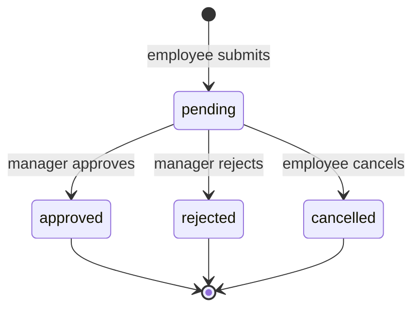
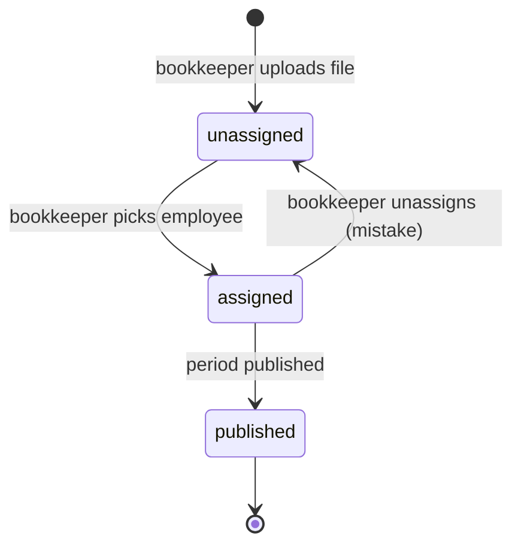

# Core Business Logic

The logic worth documenting is the part where a reasonable person could pick a
different answer. All of it lives in `lib/domain/` as pure functions over plain
inputs, which is also what makes it cheap to unit-test.

## 1. Salary insights

### Averages

Two averages, because they answer different questions:

- **Rolling 12-month average net** — "what do I typically take home?" Uses the last
  12 *published* periods, ignoring calendar-year boundaries so the number is stable
  in January instead of resetting.
- **Year-to-date average** — used for tax-adjacent reasoning, resets each January.

If fewer than 3 periods exist we show "Not enough history yet" rather than an
average of one month, which would read as precision we do not have.

### Fluctuation

"Fluctuation" is defined as the **coefficient of variation** of net pay over the
window:

\[ CV = \frac{\sigma_{net}}{\mu_{net}} \]

Standard deviation alone is not comparable between earners: ₪1,200 of variation is
noise for a ₪40k salary and rent-threatening for a ₪8k one. Dividing by the mean
makes it unitless, so the same thresholds work for everyone:

| CV | Label | Meaning |
| --- | --- | --- |
| < 0.05 | Stable | Fixed monthly salary |
| 0.05 – 0.15 | Some variation | Occasional overtime or bonuses |
| > 0.15 | Highly variable | Hourly, commission, or irregular components |

We use the **sample** standard deviation (`stddev_samp`) because 12 months is a
sample of an ongoing employment relationship, not the entire population.

Month-over-month and year-over-year deltas are shown as both absolute and
percentage change, with the base month named explicitly ("vs. February 2026")
rather than a bare arrow — an arrow next to a number leaves the reader guessing
what it is compared against.

One-off components are excluded from the trend line and shown as separate markers.
A 13th-salary or annual bonus month otherwise makes the CV spike and reports
"highly variable" for someone on a perfectly fixed salary. Classification comes
from `payslip_components.code`, which is why the component table exists.

### Deductions

From `payslip_components where kind = 'deduction'`:

- Absolute total and as a share of gross (the effective deduction rate).
- Breakdown by code: income tax, national insurance, health, pension, study fund.
- Each line's 12-month trend, which is how an employee discovers that their pension
  deduction quietly changed in March.

We are careful with language: the app says "deduction rate", never "tax rate", and
never offers tax advice. It reports what the pay slip says.

### Employer cost

Shown only to managers and the bookkeeper. Employees see their own gross, net, and
deductions; total employer cost is a budgeting figure for the team view, not a
personal metric.

## 2. Working-day calculation

Every leave request is measured in working days, computed server-side from company
data:

```ts
// lib/domain/working-days.ts
export function countWorkingDays(
  start: Date,
  end: Date,
  weekendDays: number[],          // companies.weekend_days, e.g. [5, 6]
  holidays: Map<string, { isHalfDay: boolean }>,
): number {
  let total = 0;
  for (const day of eachDayOfInterval({ start, end })) {
    if (weekendDays.includes(day.getDay())) continue;
    const holiday = holidays.get(formatISO(day, { representation: "date" }));
    if (holiday) { total += holiday.isHalfDay ? 0.5 : 0; continue; }
    total += 1;
  }
  return total;
}
```

Deliberate choices:

- **Both endpoints inclusive.** A request for March 3 → March 3 is one day. Users
  think in "from this day through that day", so the API matches the mental model
  instead of asking them to add one.
- **Half-days as 0.5.** Israeli holiday eves are half working days; rounding them
  to 0 or 1 makes annual balances drift by several days.
- **Never computed on the client.** The browser would need the holiday table and
  the client's number could be tampered with. The request form calls a tiny
  read-only action to *preview* the count; the number that gets stored is
  recomputed at insert time.

## 3. Leave accounting

```
available = entitled + carried_over + adjustment − approved − pending
```

Four rules that make this behave sensibly:

1. **Pending consumes balance.** A request that has not been decided still reserves
   days, so an employee with 5 days left and a pending 5-day request sees 0
   available. Without this, a manager can approve two requests that together exceed
   the entitlement.
2. **Cancellation and rejection release immediately.** Both are excluded from the
   sum and from the exclusion constraint's `WHERE`, so the days and the dates free
   up in the same transaction.
3. **Unpaid and reserve-duty leave do not draw down vacation.** They are separate
   `leave_types` with `is_paid = false` and zero accrual, tracked for the calendar
   without touching the vacation balance.
4. **A negative balance is possible but never automatic.** Only the bookkeeper's
   `adjustment_days` can push a balance below zero (correcting a prior year, say).
   No employee-initiated action can, because `submitTimeOffRequest` refuses.

### Monthly accrual

A Vercel Cron hits `/api/cron/accrue-leave` on the 1st of each month. For each
active employee and each `leave_type` with `accrual_days_per_month > 0`, it adds
that month's accrual to the current year's entitlement row, prorated by
`start_date` for anyone who joined mid-month.

The job is **idempotent**: it records the accrued-through month and exits early if
already run for the current period. Cron platforms retry, and a payroll system
that hands out an extra vacation day on every retry is a bug you find in December.

### Year-end carryover

On January 1, unused days up to `leave_types.max_carryover_days` move into the new
year's `carried_over_days`; the remainder expires. Both numbers are written to the
audit log, because "where did my three days go?" is a question that will be asked.

## 4. State machines

### Time-off request



`approved`, `rejected`, and `cancelled` are terminal. An employee who wants to undo
approved leave submits a new request or talks to their manager — we do not let a
decided record mutate, because the audit trail is the point. Transitions are
enforced in `decide_time_off` / `cancel_time_off` under a row lock, so two
simultaneous decisions serialize rather than race.

### Pay slip



`unassigned` rows are invisible to employees and managers by RLS, which is what
makes the "upload 40 files then sort them out" workflow safe. `assigned → unassigned`
exists because misassignment is the most likely bookkeeper error and it must be
reversible before publication. After publication it is not: correcting a published
pay slip means issuing a new one, exactly as in the paper process.

### Payroll period

`draft → published → locked`. Locking is what makes historical reports
reproducible: a trigger rejects writes to pay slips in a locked period, so an
insight computed in June cannot silently change in September.

## 5. Pay slip assignment matching

The bookkeeper's real workflow is uploading a folder of PDFs from payroll software,
often named something like `10234_2026_03.pdf`. Three tiers of help:

1. **Filename parse.** Extract candidate employee numbers and year/month. On an
   exact `(company_id, employee_number)` match, pre-fill the assignment — the
   bookkeeper confirms rather than searches.
2. **Trigram name search.** The combobox queries `employees_name_trgm`, so partial
   or misspelled Hebrew names still resolve.
3. **Manual selection.** Always available, and always the final word.

Auto-matching only ever **suggests**. Nothing is assigned without a human click,
because a wrong assignment shows one employee another's salary — the single worst
failure this product can have, and not one worth automating away for a few saved
seconds.

Duplicate protection is layered: sha256 catches the same file uploaded twice, and
`unique (period_id, employee_id)` catches two different files aimed at one person
for one month.

## 6. What the bookkeeper may edit, and why it is logged

`updateSalaryMetrics` lets the bookkeeper set gross, net, deductions, and employer
cost directly, because plenty of small payroll providers hand over a PDF with no
structured export and someone has to type the numbers in.

Every such edit writes an `audit_log` row with the before and after values.
Manually editable financial data without an audit trail is indistinguishable from
tampering, and the bookkeeper is the one person in the system with both the access
and the motive to be suspected. The log protects them as much as the employees.

Editing is blocked once the period is `locked`, and editing a `published` pay slip
does not silently change what the employee already downloaded — the UI warns that
the employee has downloaded this slip and shows the download timestamp from the
audit log.
